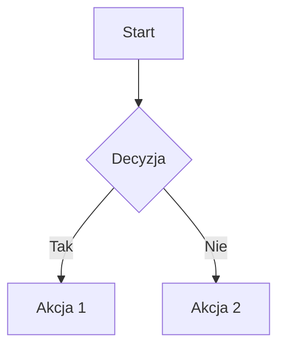

# **Zaawansowane Ćwiczenia: Microsoft Copilot dla Politechniki Śląskiej (Luty 2026)**

*Ćwiczenia praktyczne z wykorzystaniem GPT-5.2, trybu Think Deeper oraz Microsoft Copilot w Edge dla pracowników i wykładowców.*

---

> **Uwaga:** Wszystkie ćwiczenia wykorzystują najnowsze możliwości Microsoft Copilot z modelem GPT-5.2, który oferuje:
> - **Szybka odpowiedź** (Quick Response) - szybkie odpowiedzi na proste pytania
> - **GPT 5.2 Zastanów się** (Think Deeper) - głębokie rozumowanie dla złożonych zadań
> - Ulepszone podążanie za instrukcjami
> - Lepsza wydajność w matematyce i kodowaniu
> - Jaśniejsze wyjaśnienia

---

# 1. Analiza wielowymiarowa raportu naukowego z trybem Think Deeper

## 🎯 **Cel:** Wykorzystanie trybu głębokiego rozumowania do kompleksowej analizy dokumentów naukowych.

### **Instrukcje**

1. Otwórz Microsoft Copilot Chat na https://m365.cloud.microsoft/
2. W selektorze modeli (prawy górny róg) wybierz **Więcej → GPT 5.2 Zastanów się**
3. Wklej prompt wraz z fragmentem raportu lub linkiem

### **Prompt**

```
Przeanalizuj załączony raport naukowy stosując metodologię CRAAP (Currency, Relevance, Authority, Accuracy, Purpose).

ZADANIE:
1. OCENA ŹRÓDŁA:
   - Aktualność danych i metodologii
   - Wiarygodność autorów i instytucji
   - Potencjalne konflikty interesów

2. ANALIZA METODOLOGICZNA:
   - Identyfikacja zastosowanych metod badawczych
   - Ocena wielkości próby i jej reprezentatywności
   - Wykrycie potencjalnych błędów systematycznych (bias)

3. SYNTEZA KRYTYCZNA:
   - Główne wnioski vs. ograniczenia badania
   - Porównanie z obecnym stanem wiedzy w dziedzinie
   - Implikacje dla praktyki dydaktycznej na uczelni technicznej

4. REKOMENDACJE:
   - Czy raport nadaje się do cytowania w pracy naukowej?
   - Jakie dodatkowe źródła warto skonsultować?

FORMAT: Strukturyzowany raport z oceną punktową (1-10) dla każdego kryterium CRAAP.
```

### **Dlaczego GPT 5.2 Zastanów się?**

Tryb "GPT 5.2 Zastanów się":
- Tworzy plan analizy przed odpowiedzią
- Gromadzi i przetwarza cały kontekst
- Weryfikuje swoją pracę przed przedstawieniem odpowiedzi
- Idealny do złożonych zadań wymagających wieloetapowego rozumowania

### **Efekt**

* Kompleksowa ocena źródła zgodna ze standardami akademickimi
* Wykrycie potencjalnych problemów metodologicznych
* Gotowe uzasadnienie do wykorzystania lub odrzucenia źródła

---

# 2. Generowanie spersonalizowanych scenariuszy case study

## 🎯 **Cel:** Tworzenie realistycznych studiów przypadku dostosowanych do specyfiki Politechniki Śląskiej.

### **Instrukcje**

1. Otwórz Copilot Chat z modelem GPT-5.2
2. Wybierz **GPT 5.2 Zastanów się** dla złożonego zadania kreatywnego
3. Dostosuj parametry do swojego przedmiotu

### **Prompt**

```
Jesteś ekspertem w tworzeniu materiałów dydaktycznych dla uczelni technicznych.

KONTEKST:
- Uczelnia: Politechnika Śląska
- Kierunek: [WPISZ KIERUNEK, np. Automatyka i Robotyka]
- Przedmiot: [WPISZ PRZEDMIOT]
- Rok studiów: [I/II/III rok]
- Region przemysłowy: Górny Śląsk (przemysł motoryzacyjny, energetyczny, hutniczy)

ZADANIE:
Stwórz realistyczne studium przypadku (case study) spełniające następujące kryteria:

1. OSADZENIE LOKALNE:
   - Firma z regionu śląskiego lub współpracująca z lokalnymi przedsiębiorstwami
   - Rzeczywiste wyzwania techniczne charakterystyczne dla regionu
   - Uwzględnienie transformacji energetycznej Śląska

2. STRUKTURA CASE STUDY:
   - Wprowadzenie i kontekst firmy (200 słów)
   - Opis problemu technicznego (szczegółowy)
   - Dane wejściowe do analizy (tabele, parametry)
   - 3-4 pytania problemowe o rosnącej trudności
   - Kryteria oceny rozwiązań

3. WALORY DYDAKTYCZNE:
   - Połączenie teorii z praktyką przemysłową
   - Możliwość pracy grupowej
   - Otwartość na różne podejścia do rozwiązania

4. ELEMENTY DODATKOWE:
   - Słowniczek terminów branżowych (PL/EN)
   - Sugerowane źródła do samodzielnej nauki
   - Rubrics do samooceny studentów

FORMAT: Dokument gotowy do wydruku z sekcjami dla prowadzącego i studentów.
```

### **Efekt**

* Unikalne case study osadzone w kontekście regionalnym
* Materiał aktywizujący studentów do myślenia problemowego
* Gotowa dokumentacja z kryteriami oceny

---

# 3. Copilot w Edge - Głęboka analiza artykułu naukowego

## 🎯 **Cel:** Wykorzystanie funkcji "Summarize" i "Explain" w Edge do efektywnej pracy z literaturą naukową.

### **Instrukcje**

1. Otwórz artykuł naukowy (PDF lub stronę) w Microsoft Edge
2. Kliknij ikonę **Copilot** w prawym górnym rogu
3. Użyj nowych akcji: **Summarize** lub **Explain**
4. Dla zaawansowanej analizy - zaznacz fragment i kliknij prawym przyciskiem → "Ask Copilot"

### **Prompt do głębokiej analizy**

```
Przeanalizuj ten artykuł naukowy jako ekspert recenzent.

STRUKTURA ANALIZY:

1. STRESZCZENIE WYKONAWCZE (Executive Summary):
   - Główna teza w 2 zdaniach
   - Kluczowe odkrycie/wkład do nauki
   - Dla kogo jest ten artykuł?

2. MAPA ARGUMENTACJI:
   - Przedstaw strukturę logiczną artykułu jako schemat
   - Zidentyfikuj założenia przyjęte przez autorów
   - Wskaż najsilniejsze i najsłabsze argumenty

3. ANALIZA DANYCH I METOD:
   - Jakie metody zastosowano?
   - Czy dane są wystarczające dla wniosków?
   - Jakie alternatywne interpretacje są możliwe?

4. KONTEKST NAUKOWY:
   - Jak artykuł wpisuje się w obecny stan wiedzy?
   - Jakie pytania pozostają bez odpowiedzi?
   - Sugestie dla przyszłych badań

5. ZASTOSOWANIE DYDAKTYCZNE:
   - Czy nadaje się jako lektura dla studentów? (tak/nie + uzasadnienie)
   - Sugerowany poziom studiów
   - Pytania dyskusyjne do zajęć

JĘZYK: Polski, terminologia techniczna zgodna z polskimi normami.
```

### **Funkcje Edge do wykorzystania**

| Funkcja | Zastosowanie | Skrót |
|---------|-------------|-------|
| **Summarize** | Szybkie podsumowanie strony/PDF | Kliknij w pasku adresu |
| **Explain** | Wyjaśnienie złożonego fragmentu | Zaznacz tekst → Explain |
| **Rewrite** | Przeformułowanie tekstu | PPM w polu tekstowym |
| **Ask Copilot** | Dowolne pytanie o zaznaczony fragment | PPM → Ask Copilot |

### **Efekt**

* Szybkie zrozumienie złożonych artykułów
* Gotowe notatki do dalszej pracy
* Ocena przydatności dydaktycznej materiału

---

# 4. Tworzenie adaptacyjnych materiałów egzaminacyjnych

## 🎯 **Cel:** Generowanie zestawów pytań o różnym poziomie trudności z wykorzystaniem taksonomii Blooma.

### **Instrukcje**

1. Otwórz Copilot Chat z GPT-5.2
2. Dla złożonego zestawu wybierz **GPT 5.2 Zastanów się**
3. Dostosuj parametry do swojego przedmiotu

### **Prompt**

```
Stwórz adaptacyjny zestaw pytań egzaminacyjnych zgodny z taksonomią Blooma.

PARAMETRY:
- Przedmiot: [WPISZ PRZEDMIOT]
- Temat: [WPISZ TEMAT]
- Liczba pytań: 20
- Format: Gotowy do Microsoft Forms / Moodle

STRUKTURA ZESTAWU (według poziomów Blooma):

POZIOM 1 - ZAPAMIĘTYWANIE (4 pytania):
- Definicje, fakty, podstawowe wzory
- Jednokrotny wybór, 4 odpowiedzi
- Czas: 1 min/pytanie

POZIOM 2 - ROZUMIENIE (4 pytania):
- Interpretacja wykresów, wyjaśnianie zjawisk
- Wielokrotny wybór lub dopasowywanie
- Czas: 2 min/pytanie

POZIOM 3 - STOSOWANIE (4 pytania):
- Obliczenia, zastosowanie wzorów w nowych kontekstach
- Pytania otwarte krótkie lub liczbowe
- Czas: 3 min/pytanie

POZIOM 4 - ANALIZOWANIE (4 pytania):
- Porównywanie metod, identyfikacja błędów
- Studia przypadku mini
- Czas: 4 min/pytanie

POZIOM 5 - OCENIANIE (2 pytania):
- Wybór optymalnego rozwiązania z uzasadnieniem
- Ocena wad i zalet podejść
- Czas: 5 min/pytanie

POZIOM 6 - TWORZENIE (2 pytania):
- Projektowanie rozwiązania problemu
- Pytanie otwarte rozbudowane
- Czas: 10 min/pytanie

WYMAGANIA DODATKOWE:
- Każde pytanie z oznaczeniem poziomu Blooma
- Klucz odpowiedzi z uzasadnieniem
- Punktacja: poziom 1-2 = 1 pkt, poziom 3-4 = 2 pkt, poziom 5-6 = 3 pkt
- Łączny czas: 60 minut
- Próg zaliczenia: 50%
```

### **Efekt**

* Zbalansowany zestaw pytań mierzący różne kompetencje
* Gotowy do importu do systemów e-learningowych
* Transparentne kryteria oceny

---

# 5. Symulator rozmowy kwalifikacyjnej dla studentów

## 🎯 **Cel:** Przygotowanie studentów do rozmów kwalifikacyjnych w firmach technicznych regionu.

### **Instrukcje**

1. Otwórz Copilot Chat
2. Wybierz **GPT 5.2 Zastanów się** dla realistycznej symulacji
3. Poproś o kontynuację rozmowy w kolejnych promptach

### **Prompt**

```
Wciel się w rolę doświadczonego rekrutera technicznego z firmy [NAZWA FIRMY, np. Stellantis Gliwice / Nexteer / Famur].

KONTEKST:
- Stanowisko: [np. Inżynier procesu / Programista PLC / Analityk danych]
- Kandydat: Student ostatniego roku [KIERUNEK] Politechniki Śląskiej
- Typ rozmowy: Techniczna + behawioralna (metoda STAR)

PRZEBIEG SYMULACJI:

1. WPROWADZENIE (jako rekruter):
   - Krótkie przedstawienie firmy i stanowiska
   - Wyjaśnienie struktury rozmowy

2. PYTANIA TECHNICZNE (5 pytań):
   - Pytania z zakresu wiedzy wymaganej na stanowisku
   - Jedno pytanie problemowe do rozwiązania "na żywo"
   - Pytanie o projekty/praktyki z CV

3. PYTANIA BEHAWIORALNE STAR (3 pytania):
   - Sytuacja konfliktowa w zespole
   - Projekt pod presją czasu
   - Porażka i wyciągnięte wnioski

4. PYTANIA KANDYDATA:
   - Zachęć do zadawania pytań
   - Odpowiedz jak prawdziwy rekruter

ZASADY INTERAKCJI:
- Czekaj na odpowiedź przed kolejnym pytaniem
- Zadawaj pytania pogłębiające ("Możesz rozwinąć?", "Jakie były konsekwencje?")
- Na końcu daj konstruktywny feedback: mocne strony + obszary do poprawy
- Oceń kandydata w skali 1-5 w kategoriach: wiedza techniczna, komunikacja, dopasowanie kulturowe

ROZPOCZNIJ od powitania i przedstawienia się jako rekruter.
```

### **Efekt**

* Realistyczne przygotowanie do rozmów w lokalnych firmach
* Feedback zgodny z rzeczywistymi praktykami rekrutacyjnymi
* Możliwość wielokrotnego ćwiczenia z różnymi scenariuszami

---

# 6. Analiza kodu i dokumentacji technicznej w Edge

## 🎯 **Cel:** Wykorzystanie Copilot w Edge do analizy dokumentacji technicznej i kodu źródłowego.

### **Instrukcje**

1. Otwórz dokumentację techniczną lub repozytorium GitHub w Edge
2. Kliknij ikonę Copilot
3. Użyj funkcji **Explain** na złożonych fragmentach kodu

### **Prompt do analizy kodu**

```
Przeanalizuj ten kod/dokumentację jako doświadczony inżynier oprogramowania.

ZADANIE:

1. ARCHITEKTURA:
   - Opisz strukturę i wzorce projektowe
   - Zidentyfikuj zależności między komponentami
   - Stwórz diagram przepływu danych (w formie tekstowej ASCII)

2. ANALIZA JAKOŚCI:
   - Zgodność z zasadami SOLID
   - Potencjalne problemy wydajnościowe
   - Bezpieczeństwo (OWASP Top 10)
   - Testowalność kodu

3. DOKUMENTACJA:
   - Czy kod jest samodokumentujący?
   - Brakujące komentarze/docstringi
   - Sugestie nazewnictwa

4. REFAKTORYZACJA:
   - 3 konkretne propozycje ulepszeń
   - Priorytet zmian (wysoki/średni/niski)
   - Szacunkowy nakład pracy

5. MATERIAŁ DYDAKTYCZNY:
   - Jakie koncepty programistyczne ilustruje ten kod?
   - Pytania do studentów na podstawie kodu
   - Ćwiczenia do samodzielnej modyfikacji

FORMAT: Raport techniczny z kolorowaniem składni dla fragmentów kodu.
```

### **Efekt**

* Szybkie zrozumienie obcego kodu
* Gotowe materiały do zajęć z programowania
* Identyfikacja wzorców do nauki

---

# 7. Tworzenie interaktywnych symulacji problemów inżynierskich

## 🎯 **Cel:** Generowanie scenariuszy symulacyjnych do rozwiązywania problemów technicznych.

### **Instrukcje**

1. Otwórz Copilot Chat z **GPT 5.2 Zastanów się**
2. Wklej prompt z parametrami swojego przedmiotu
3. Kontynuuj interakcję, rozwijając symulację

### **Prompt**

```
Stwórz interaktywną symulację problemu inżynierskiego w formie "wybierz swoją przygodę".

PARAMETRY:
- Dziedzina: [np. Automatyka przemysłowa / Mechanika / Energetyka]
- Poziom: [Student III roku / Magisterskie]
- Czas trwania: 45 minut zajęć

SCENARIUSZ BAZOWY:
[Opisz krótko kontekst, np. "Awaria linii produkcyjnej w fabryce samochodów"]

STRUKTURA SYMULACJI:

1. WPROWADZENIE:
   - Opis sytuacji wyjściowej
   - Dostępne zasoby i ograniczenia
   - Cel do osiągnięcia

2. PUNKTY DECYZYJNE (minimum 5):
   - Każdy punkt oferuje 3-4 opcje działania
   - Każda opcja prowadzi do różnych konsekwencji
   - Uwzględnij: czas, koszt, bezpieczeństwo, jakość

3. DANE TECHNICZNE:
   - Parametry urządzeń
   - Schematy/diagramy (opisane tekstowo)
   - Normy i procedury do przestrzegania

4. ŚCIEŻKI ROZWIĄZANIA:
   - Optymalna (pełna punktacja)
   - Akceptowalna (częściowa punktacja)
   - Błędna (analiza błędu)

5. DEBRIEFING:
   - Podsumowanie decyzji
   - Porównanie ścieżek
   - Lekcje do zapamiętania

MECHANIKA:
- Prowadź mnie przez symulację krok po kroku
- Czekaj na mój wybór przed kontynuacją
- Po każdej decyzji pokaż konsekwencje
- Na końcu przedstaw pełną analizę

ROZPOCZNIJ symulację od opisu sytuacji wyjściowej.
```

### **Efekt**

* Angażująca forma nauki przez doświadczenie
* Bezpieczne środowisko do popełniania błędów
* Rozwój kompetencji decyzyjnych

---

# 8. Asystent pisania wniosków grantowych

## 🎯 **Cel:** Wsparcie w przygotowaniu wniosków o finansowanie badań (NCN, NCBiR, Horyzont Europa).

### **Instrukcje**

1. Otwórz Copilot Chat z **GPT 5.2 Zastanów się** (wymaga głębokiego rozumowania)
2. Dostosuj prompt do konkretnego konkursu

### **Prompt**

```
Jako ekspert w pisaniu wniosków grantowych, pomóż mi przygotować sekcję wniosku.

KONTEKST:
- Program: [NCN OPUS / NCBiR / Horyzont Europa]
- Dziedzina: [WPISZ DZIEDZINĘ]
- Tytuł projektu: [WPISZ ROBOCZY TYTUŁ]
- Budżet szacunkowy: [KWOTA]
- Czas trwania: [LICZBA MIESIĘCY]

SEKCJA DO OPRACOWANIA: [WYBIERZ]
□ Streszczenie projektu (Abstract)
□ Stan wiedzy i uzasadnienie
□ Cele i hipotezy badawcze
□ Metodologia
□ Plan zarządzania danymi
□ Wpływ i rezultaty (Impact)
□ Harmonogram i kamienie milowe

WYMAGANIA:

1. JĘZYK I STYL:
   - Zgodny z wytycznymi programu
   - Precyzyjny, bez żargonu
   - Przekonujący dla recenzentów

2. STRUKTURA:
   - Zgodna z formularzem aplikacyjnym
   - Odpowiednia długość (podaj limit znaków jeśli znany)
   - Wyraźne nagłówki i podpunkty

3. ELEMENTY KLUCZOWE:
   - Nowość naukowa (co nowego wnosimy?)
   - Wykonalność (czy mamy kompetencje i zasoby?)
   - Wpływ (kto skorzysta z wyników?)

4. KRYTERIA EWALUACJI:
   - Wskaż, jak tekst odpowiada na typowe kryteria oceny
   - Zasugeruj mocne strony do podkreślenia
   - Zidentyfikuj potencjalne słabości do adresowania

FORMAT: Tekst gotowy do wklejenia z komentarzami [w nawiasach kwadratowych] gdzie potrzebuję dodać konkretne dane.
```

### **Efekt**

* Profesjonalnie napisane sekcje wniosku
* Zgodność z wymogami formalnymi
* Zwiększenie szans na pozytywną ocenę

---

# 9. Personalizacja feedbacku dla studentów

## 🎯 **Cel:** Generowanie konstruktywnej informacji zwrotnej dostosowanej do indywidualnych potrzeb studenta.

### **Instrukcje**

1. Otwórz Copilot Chat
2. Wklej pracę studenta wraz z promptem
3. Dostosuj ton i szczegółowość do kontekstu

### **Prompt**

```
Przeanalizuj pracę studenta i wygeneruj spersonalizowany feedback.

KONTEKST:
- Typ pracy: [Projekt / Sprawozdanie / Kod / Esej]
- Przedmiot: [NAZWA]
- Kryteria oceny: [WKLEJ LUB OPISZ]
- Obecna ocena studenta z przedmiotu: [jeśli znana]

PRACA STUDENTA:
[WKLEJ TREŚĆ PRACY]

STRUKTURA FEEDBACKU:

1. POZYTYWNE ASPEKTY (co student zrobił dobrze):
   - Minimum 3 konkretne pochwały
   - Odniesienie do konkretnych fragmentów pracy
   - Wskazanie rozwoju w porównaniu do poprzednich prac (jeśli dotyczy)

2. OBSZARY DO POPRAWY (konstruktywna krytyka):
   - Maksimum 3 najważniejsze kwestie
   - Konkretne przykłady problemu
   - ZAWSZE z sugestią jak poprawić

3. PYTANIA ROZWOJOWE:
   - 2-3 pytania zachęcające do głębszej refleksji
   - Prowadzące do samodzielnego odkrycia błędów

4. NASTĘPNE KROKI:
   - Konkretne działania do podjęcia
   - Zasoby do samodzielnej nauki
   - Termin ewentualnej poprawy

5. OCENA:
   - Proponowana ocena z uzasadnieniem
   - Odniesienie do kryteriów

TON: Wspierający, ale szczery. Student powinien czuć się zmotywowany do poprawy, nie zdemotywowany krytyką.

FORMAT: Gotowy tekst do wysłania studentowi (bez technicznych oznaczeń).
```

### **Efekt**

* Zbalansowany feedback wspierający rozwój
* Oszczędność czasu przy zachowaniu jakości
* Spójny standard informacji zwrotnej

---

# 10. Tworzenie diagramów i wizualizacji (tekstowych) dla prezentacji

## 🎯 **Cel:** Generowanie opisów diagramów i schematów do wykorzystania w narzędziach wizualizacyjnych.

### **Instrukcje**

1. Otwórz Copilot Chat
2. Wybierz **Szybka odpowiedź** dla prostych diagramów lub **GPT 5.2 Zastanów się** dla złożonych
3. Użyj wygenerowanego kodu w narzędziach jak Mermaid, PlantUML lub draw.io

### **Prompt**

```
Stwórz diagram/schemat w formacie tekstowym (Mermaid/PlantUML) do wykorzystania w prezentacji.

TYP DIAGRAMU: [WYBIERZ]
□ Diagram przepływu (flowchart)
□ Diagram sekwencji (sequence diagram)
□ Diagram klas (class diagram)
□ Diagram stanów (state diagram)
□ Diagram Gantta (timeline)
□ Mind mapa
□ Diagram ER (baza danych)

TEMAT: [OPISZ CO MA PRZEDSTAWIAĆ DIAGRAM]

WYMAGANIA:
- Format: Mermaid (kompatybilny z PowerPoint, Notion, GitHub)
- Język etykiet: Polski
- Poziom szczegółowości: [Ogólny / Szczegółowy]
- Kolorystyka: [Domyślna / Profesjonalna / Zgodna z CI Politechniki]

DODATKOWO:
- Dodaj legendę jeśli potrzebna
- Uwzględnij numery referencyjne dla elementów
- Zaproponuj alternatywny sposób wizualizacji

PRZYKŁAD OCZEKIWANEGO FORMATU:


Wygeneruj kod diagramu gotowy do użycia.
```

### **Efekt**

* Profesjonalne diagramy w minuty
* Kod do edycji i modyfikacji
* Spójność wizualna materiałów

---

# 11. Analiza porównawcza źródeł naukowych w Edge

## 🎯 **Cel:** Wykorzystanie Copilot w Edge do porównania wielu artykułów naukowych.

### **Instrukcje**

1. Otwórz 2-3 artykuły w osobnych kartach Edge
2. Kliknij Copilot i użyj kontekstu wielu kart
3. Alternatywnie: wgraj PDFy przez przycisk "+"

### **Prompt**

```
Przeprowadź systematyczną analizę porównawczą załączonych/otwartych artykułów naukowych.

ASPEKTY PORÓWNANIA:

1. METADANE:
| Kryterium | Artykuł 1 | Artykuł 2 | Artykuł 3 |
|-----------|-----------|-----------|-----------|
| Autorzy | | | |
| Rok publikacji | | | |
| Czasopismo/Konferencja | | | |
| Impact Factor | | | |
| Liczba cytowań | | | |

2. METODOLOGIA:
- Porównaj podejścia badawcze
- Zidentyfikuj różnice w założeniach
- Oceń rzetelność każdej metody

3. WYNIKI:
- Gdzie wyniki są zgodne?
- Gdzie występują rozbieżności?
- Jak autorzy wyjaśniają różnice?

4. WNIOSKI:
- Synteza wspólnych wniosków
- Punkty sporne wymagające dalszych badań
- Która praca jest najbardziej wiarygodna i dlaczego?

5. REKOMENDACJA DYDAKTYCZNA:
- Która praca najlepiej nadaje się jako podstawowa lektura?
- W jakiej kolejności czytać te prace?
- Jakie pytania seminaryjne można sformułować?

FORMAT: Raport porównawczy z tabelami i podsumowaniem.
```

### **Efekt**

* Szybkie zorientowanie się w stanie badań
* Gotowy materiał do przeglądu literatury
* Podstawa do dyskusji seminaryjnej

---

# 12. Generator rubryk oceniania

## 🎯 **Cel:** Tworzenie przejrzystych rubryk do oceny projektów i prac.

### **Instrukcje**

1. Otwórz Copilot Chat z **GPT 5.2 Zastanów się**
2. Określ typ pracy i kryteria

### **Prompt**

```
Stwórz szczegółową rubrykę oceniania dla pracy/projektu studenckiego.

PARAMETRY:
- Typ pracy: [Projekt zespołowy / Praca indywidualna / Prezentacja / Sprawozdanie]
- Przedmiot: [NAZWA]
- Maksymalna liczba punktów: [np. 100]
- Liczba kryteriów: [5-8]

WYMAGANIA DLA RUBRYKI:

1. STRUKTURA:
   Każde kryterium zawiera:
   - Nazwa kryterium
   - Waga (% całości)
   - 4 poziomy wykonania:
     * Wybitny (100%)
     * Dobry (75%)
     * Podstawowy (50%)
     * Niewystarczający (25%)
   - Konkretne wskaźniki dla każdego poziomu

2. KRYTERIA DO UWZGLĘDNIENIA:
   - Merytoryka/treść
   - Metodologia/podejście
   - Prezentacja/forma
   - Oryginalność
   - [Dodaj specyficzne dla przedmiotu]

3. FORMAT:
   - Tabela gotowa do wydruku
   - Miejsce na komentarze przy każdym kryterium
   - Podsumowanie z końcową oceną

4. DODATKI:
   - Skala przeliczeniowa na oceny (2-5)
   - Instrukcja dla studenta: jak czytać rubrykę
   - Arkusz samooceny dla studenta

JĘZYK: Polski, profesjonalny ale zrozumiały dla studentów.
```

### **Efekt**

* Transparentne kryteria oceny
* Redukcja sporów o oceny
* Wsparcie samooceny studentów

---

# 13. Asystent przygotowania do konferencji naukowej

## 🎯 **Cel:** Kompleksowe wsparcie w przygotowaniu wystąpienia konferencyjnego.

### **Instrukcje**

1. Otwórz Copilot Chat z **GPT 5.2 Zastanów się**
2. Podziel zadanie na etapy

### **Prompt**

```
Pomóż mi przygotować wystąpienie na konferencję naukową.

DANE KONFERENCJI:
- Nazwa: [NAZWA KONFERENCJI]
- Typ wystąpienia: [Referat 15 min / Poster / Keynote]
- Dziedzina: [DZIEDZINA]
- Audience: [Specjaliści / Interdyscyplinarny / Studenci]

MOJE BADANIA:
[Krótki opis tematu - 2-3 zdania]

ETAP DO OPRACOWANIA: [WYBIERZ]

□ ABSTRAKT:
  - Struktura IMRAD (Introduction, Methods, Results, Discussion)
  - Limit znaków: [podaj]
  - Słowa kluczowe: 5-7

□ STRUKTURA PREZENTACJI:
  - Rozkład czasowy na sekcje
  - Kluczowe slajdy (tytuły i główne punkty)
  - Momenty interakcji z publicznością

□ SLAJD TYTUŁOWY I WSTĘP:
  - Hook - jak przyciągnąć uwagę
  - Kontekst i znaczenie badań
  - Cel prezentacji

□ WIZUALIZACJA WYNIKÓW:
  - Jak przedstawić dane na slajdach
  - Sugestie wykresów i diagramów
  - Animacje i przejścia

□ PODSUMOWANIE I DYSKUSJA:
  - Take-home message
  - Ograniczenia badań
  - Kierunki przyszłych prac

□ PRZYGOTOWANIE DO Q&A:
  - Przewidywane trudne pytania
  - Szkice odpowiedzi
  - Pytania na które NIE znam odpowiedzi (i jak to zakomunikować)

□ POSTER NAUKOWY:
  - Układ sekcji
  - Proporcje tekstu/grafiki
  - Hierarchia informacji

FORMAT: Szczegółowe wskazówki z przykładami tekstów do wykorzystania.
```

### **Efekt**

* Profesjonalne przygotowanie wystąpienia
* Pewność siebie podczas prezentacji
* Gotowość na sesję pytań

---

# 14. Optymalizacja sylabusa przedmiotu

## 🎯 **Cel:** Analiza i ulepszenie istniejącego sylabusa z wykorzystaniem AI.

### **Instrukcje**

1. Wgraj sylabus do Copilot Chat (przycisk "+")
2. Wybierz **GPT 5.2 Zastanów się** dla kompleksowej analizy

### **Prompt**

```
Przeanalizuj i zoptymalizuj sylabus przedmiotu zgodnie z najlepszymi praktykami dydaktyki akademickiej.

KONTEKST:
- Przedmiot: [NAZWA]
- Kierunek: [KIERUNEK]
- Rok/Semestr: [np. II rok, semestr zimowy]
- Forma: [Wykład / Ćwiczenia / Laboratorium / Projekt]
- ECTS: [LICZBA]

SYLABUS DO ANALIZY:
[WKLEJ LUB ZAŁĄCZ]

OBSZARY ANALIZY:

1. CELE KSZTAŁCENIA:
   - Czy są mierzalne i konkretne?
   - Zgodność z efektami PRK (Polska Rama Kwalifikacji)
   - Czy obejmują wiedzę, umiejętności i kompetencje społeczne?

2. TREŚCI PROGRAMOWE:
   - Logiczna sekwencja tematów
   - Proporcje teorii i praktyki
   - Aktualność treści (czy nie są przestarzałe?)
   - Luki lub redundancje

3. METODY DYDAKTYCZNE:
   - Różnorodność metod
   - Dopasowanie do celów i treści
   - Wykorzystanie technologii
   - Aktywizacja studentów

4. OCENIANIE:
   - Czy formy oceny odpowiadają celom?
   - Rozkład punktacji (proporcjonalność)
   - Feedback formatywny vs sumatywny

5. OBCIĄŻENIE STUDENTA:
   - Realność czasowa (zgodność z ECTS)
   - Rozkład pracy w semestrze

6. DOSTĘPNOŚĆ I INKLUZYWNOŚĆ:
   - Czy sylabus uwzględnia różne style uczenia się?
   - Dostępność dla osób z niepełnosprawnościami

REKOMENDACJE:
- Minimum 5 konkretnych usprawnień
- Priorytetyzacja (łatwe/szybkie vs wymagające nakładów)
- Przykłady tekstów do zastąpienia

FORMAT: Raport z oceną obecnego stanu i propozycjami zmian.
```

### **Efekt**

* Profesjonalny, zgodny ze standardami sylabus
* Identyfikacja obszarów do poprawy
* Gotowe sformułowania do wykorzystania

---

# 15. Tworzenie materiałów do nauczania hybrydowego

## 🎯 **Cel:** Projektowanie zajęć łączących elementy stacjonarne i online.

### **Instrukcje**

1. Otwórz Copilot Chat z **GPT 5.2 Zastanów się**
2. Określ dostępne narzędzia technologiczne

### **Prompt**

```
Zaprojektuj zajęcia w modelu hybrydowym (blended learning) z wykorzystaniem dostępnych na uczelni narzędzi.

PARAMETRY:
- Przedmiot: [NAZWA]
- Temat zajęć: [TEMAT]
- Czas całkowity: [np. 2h synchronicznie + 2h asynchronicznie]
- Liczba studentów: [LICZBA]
- Dostępne narzędzia: Microsoft Teams, Moodle, Forms, Stream, OneNote

STRUKTURA ZAJĘĆ:

1. PRE-WORK (przed zajęciami synchronicznymi):
   - Co student ma przygotować samodzielnie?
   - Jakie materiały udostępnić? (wideo, czytanka, quiz wstępny)
   - Jak zweryfikować przygotowanie?
   - Czas: [X] minut

2. ZAJĘCIA SYNCHRONICZNE (na żywo):
   - Agenda minute-by-minute
   - Elementy interaktywne (polls, breakout rooms, whiteboard)
   - Balans: wykład vs. aktywność studentów
   - Plan B przy problemach technicznych
   - Czas: [X] minut

3. POST-WORK (po zajęciach):
   - Zadanie utrwalające
   - Forum dyskusyjne - pytanie do refleksji
   - Quiz podsumowujący
   - Czas: [X] minut

4. MATERIAŁY DO PRZYGOTOWANIA:
   - Slajdy z notatkami głosowymi
   - Krótkie wideo (do 6 min)
   - Instrukcje dla studentów
   - Kryteria oceny

5. INKLUZYWNOŚĆ:
   - Alternatywy dla osób bez kamery/mikrofonu
   - Nagranie zajęć dla nieobecnych
   - Różne kanały kontaktu

FORMAT: Szczegółowy scenariusz z timestampami i checklistą przygotowań.
```

### **Efekt**

* Kompletny scenariusz zajęć hybrydowych
* Optymalne wykorzystanie czasu studentów
* Gotowe materiały do wielu narzędzi

---

# **Podsumowanie: Najlepsze praktyki promptowania 2026**

## Struktura skutecznego promptu (metoda GCEFS):

| Element | Opis | Przykład |
|---------|------|----------|
| **G**oal | Konkretny cel | "Stwórz test z 10 pytań" |
| **C**ontext | Kontekst użycia | "Dla studentów II roku mechaniki" |
| **E**xpectations | Oczekiwany format | "W formacie gotowym do MS Forms" |
| **F**ormat | Struktura odpowiedzi | "Tabela z pytaniami i odpowiedziami" |
| **S**ource | Źródła/ograniczenia | "Na podstawie rozdziału 3 podręcznika" |

## Kiedy używać którego trybu?

| Tryb (PL) | Tryb (EN) | Zastosowanie | Czas odpowiedzi |
|-----------|-----------|-------------|-----------------|
| **Szybka odpowiedź** | Quick Response | Proste pytania, definicje, tłumaczenia | Sekundy |
| **GPT 5.2 Zastanów się** | GPT 5.2 Zastanów się | Analiza, planowanie, złożone rozumowanie | Do kilku minut |
| **Auto** | Auto | Copilot sam wybiera najlepszy tryb | Zmienny |

## Funkcje Copilot w Edge - szybka ściągawka:

| Funkcja | Skrót / Dostęp | Zastosowanie |
|---------|---------------|--------------|
| Summarize | Pasek adresu | Podsumowanie strony/PDF |
| Explain | Zaznacz → PPM | Wyjaśnienie fragmentu |
| Rewrite | PPM w polu tekstu | Przeformułowanie |
| Ask Copilot | Zaznacz → Ask Copilot | Dowolne pytanie |

---

## Źródła i dokumentacja Microsoft Learn

- [Microsoft 365 Copilot Release Notes](https://learn.microsoft.com/en-us/copilot/microsoft-365/release-notes)
- [Copilot Chat Overview](https://learn.microsoft.com/en-us/copilot/overview)
- [Copilot Chat in Edge](https://learn.microsoft.com/en-us/copilot/edge)
- [Write Effective Prompts](https://learn.microsoft.com/en-us/azure/copilot/write-effective-prompts)
- [Deep Reasoning Models in Copilot Studio](https://learn.microsoft.com/en-us/microsoft-copilot-studio/authoring-reasoning-models)

---

*Dokument przygotowany dla Politechniki Śląskiej | Luty 2026*
*Zgodny z najnowszymi funkcjami Microsoft Copilot GPT-5.2*
